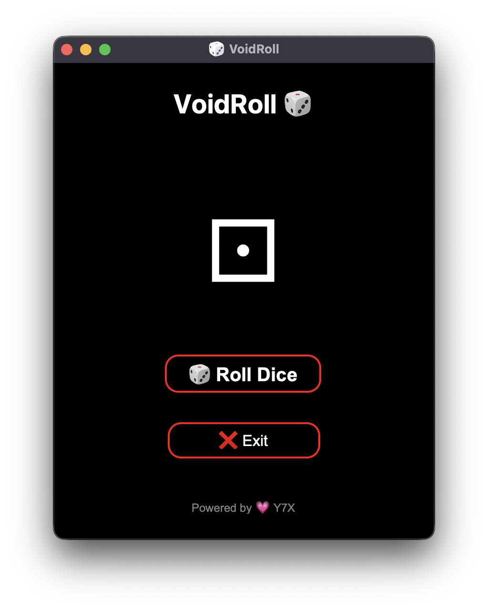

<div align="center">

# 🎲 VoidRoll
**🌑 Enter the void — VoidRoll ignites**

Roll in style.
A glowing dice simulator with pitch-black AMOLED vibes and that signature.
Branded with 💗 by [Y7X-bit](https://github.com/Y7X-bit)



</div>

---

## 🌟 Features at a Glance

- ⚀ Smooth dice roll animation  
- 🌑 Full AMOLED black UI — no greys, no compromises  
- 🔴 Red-outlined pill-shaped buttons  
- ⚪ Crisp white text across the app  
- 💗 Custom branding: "Powered by Y7X"  
- 🖱️ One-click interface — roll and relax

---

## 🖥️ Installation

> Python 3.9 or later required

```bash
git clone https://github.com/Y7X-bit/VoidRoll.git
cd VoidRoll
pip install -r requirements.txt
python VoidRoll.py